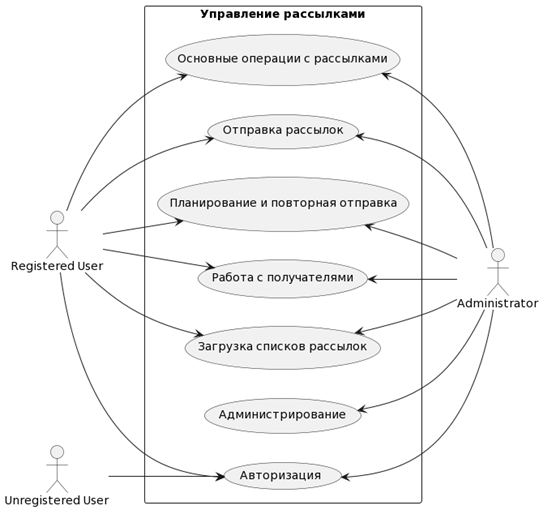
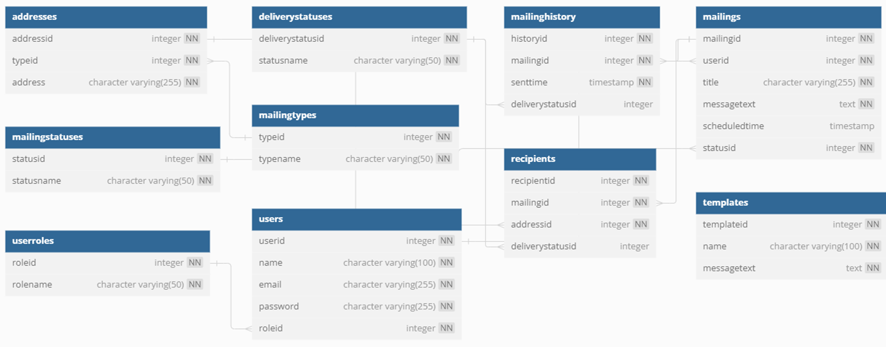

# Информационная система управления рассылками (DSS)

## Описание
Данная распределённая программная система (DSS) предназначена для управления рассылками через различные каналы связи, включая электронную почту и мессенджеры. 

Система предоставляет возможность:
- Создавать, редактировать и удалять рассылки.
- Загружать списки получателей из различных источников.
- Отправлять рассылки через интегрированные API.

# Первоначальные требования

* Возможность создавать, редактировать, удалять и запускать рассылки.
* Поддержка различных каналов связи (email, Telegram, сторонние API).
* Управление списками получателей, возможность загружать их из внешних источников.
* Запланированные и повторяющиеся рассылки.
* Отслеживание статуса отправленных сообщений (доставлено, ошибка, отказ).
* Аутентификация и разграничение прав пользователей (администраторы, менеджеры).
* Интеграция с внешними сервисами (SMTP, Telegram API, Sendsay и др.).

# Модель предметной области (DDD)

## UseCase

## 1. Основные контексты (Bounded Contexts)

В системе можно выделить следующие контексты:
*	Контекст управления рассылками (Mailing Management Context) — отвечает за создание, управление и отправку рассылок.
*	Контекст аутентификации и управления пользователями (User Management Context) — управляет пользователями и их ролями.
*	Контекст доставки сообщений (Message Delivery Context) — отслеживает статусы доставки сообщений и ведёт историю.

## 2. Основные агрегаты и сущности

### №1 Агрегат: "Рассылка" (Mailing)

Описание: агрегат, представляющий рассылку. Включает саму рассылку, её получателей и статусы.
Корневая сущность: Mailing
Другие сущности в агрегате:
- Recipient (получатель)
- MailingStatus (статус рассылки)
- MailingType (тип рассылки)

### №2 Агрегат: "Пользователь" (User)

Описание: агрегат, представляющий пользователя системы. Включает роль пользователя и его email.
Корневая сущность: User
Другие сущности в агрегате:
- UserRole (роль пользователя)

### №3  Агрегат: "Доставка сообщений" (MessageDelivery)
Описание: агрегат, отвечающий за доставку сообщений и их статусы. Включает историю отправки.
Корневая сущность: MailingHistory
Другие сущности в агрегате:
- DeliveryStatus (статус доставки)

## 3. Взаимодействие контекстов
* Связь "Управление рассылками" ↔ "Пользователи"

Каждая рассылка создаётся пользователем (User → Mailing).

* Связь "Управление рассылками" ↔ "Доставка сообщений"

Отправленные рассылки фиксируются в истории (Mailing → MailingHistory).  
Для каждого получателя отслеживается статус доставки (Recipient → DeliveryStatus).

# Инструментарий для реализации

## 1. Языки программирования и фреймворки
* Backend: Python (FastAPI)
* Frontend: Vue.js (с использованием Vuetify и Pinia)
## 2. Среда разработки (IDE)
    Visual Studio Code (VS Code)  
## 3. База данных
    PostgreSQL  
## 4. Инфраструктура и контейнеризация
* Docker (для контейнеризации и развертывания приложения)
* Git (для управления версиями кода)
## 5. Основные зависимости (Python)

В проекте используются следующие ключевые библиотеки:

* FastAPI — асинхронный веб-фреймворк для разработки API
* SQLAlchemy — ORM для работы с базой данных
* psycopg2 — драйвер для работы с PostgreSQL
* Pydantic — валидация данных
* Uvicorn — ASGI-сервер для запуска FastAPI
* aiofiles, aiosignal, aiohttp — асинхронные инструменты для работы с файлами и HTTP-запросами
* python-dotenv — работа с переменными окружения
* bcrypt, passlib — хеширование паролей
* requests — выполнение HTTP-запросов
## 6. Основные зависимости (Frontend)
* Vue.js — фреймворк для разработки пользовательского интерфейса
* Vuetify — UI-библиотека на основе Material Design
* Pinia — управление состоянием приложения
## 7. Управление зависимостями
* Backend: pip + requirements.txt
* Frontend: npm
## 8. Хостинг и развертывание
Исходный код загружен в репозиторий (GitHub) и упакован в контейнер Docker для удобного развертывания.

# Модель данных для реализации

## 1. Модель данных на уровне приложения
На уровне приложения используется объектно-реляционная модель данных, реализованная с помощью **SQLAlchemy** (ORM для Python).
Это позволяет работать с базой данных через объекты и классы, обеспечивая удобство и гибкость при разработке.  

Основные компоненты модели:  
- **User (Пользователь)** – сущность, хранящая данные о пользователях системы, их роли и учетные данные.  
- **Mailing (Рассылка)** – основная сущность, представляющая создание и управление массовыми рассылками.  
- **Recipient (Получатель)** – объект, связывающий рассылку с контактными данными.  
- **Address (Адрес)** – отдельная сущность, обеспечивающая хранение email-адресов и их типов.  
- **Template (Шаблон)** – механизм повторного использования текстов сообщений.  
- **MailingHistory (История рассылок)** – позволяет отслеживать отправленные сообщения и их статусы доставки.  

ORM-слой обеспечивает валидацию данных, преобразование объектов в SQL-запросы и их безопасное выполнение.  

## 2. Модель данных на уровне хранения
На уровне хранения используется **реляционная модель данных** на основе **PostgreSQL**.
Данные организованы в виде нормализованных таблиц, имеющих связи через первичные и внешние ключи.  

### Ключевые аспекты хранения данных:  
- **Таблица `users`** – содержит учетные данные пользователей с хешированными паролями.  
- **Таблица `mailings`** – хранит основные сведения о рассылках, включая запланированное время отправки и статус.  
- **Таблица `recipients`** – связывает рассылку с получателями через `mailingid` и `addressid`.  
- **Таблица `addresses`** – обеспечивает хранение email-адресов и их классификацию по типам.  
- **Таблица `templates`** – позволяет пользователям создавать и использовать шаблоны сообщений.  
- **Таблица `mailinghistory`** – фиксирует историю отправок и статусы доставки.  

### Особенности хранения:  
- **Индексация** – для ускорения поиска используется индексация по ключевым полям (`email`, `userid`, `mailingid`).  
- **Целостность данных** – реализована с помощью внешних ключей и каскадных ограничений.  
- **Шардирование (потенциальное)** – в будущем можно масштабировать систему, распределяя данные рассылок по нескольким узлам.

## Схема базы данных

# Реализация

Весь программный код системы доступен в репозитории GitHub - [Ссылка!](https://github.com/KosmixGT/mailforge)